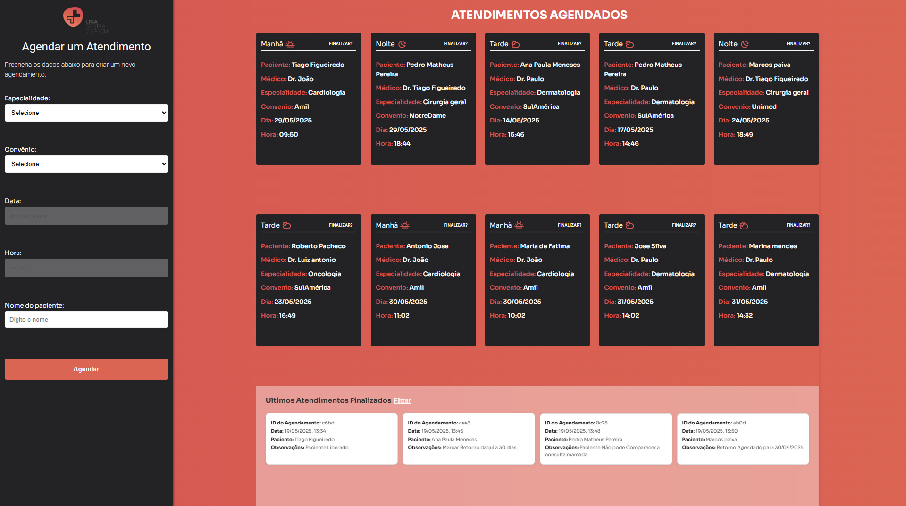
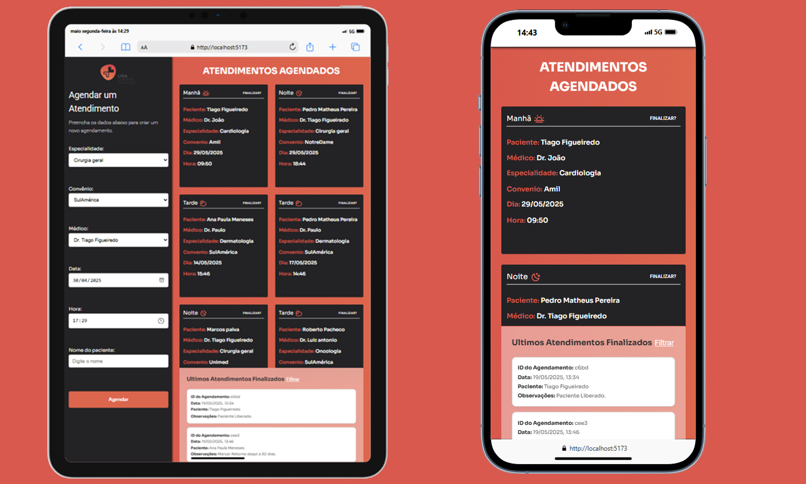
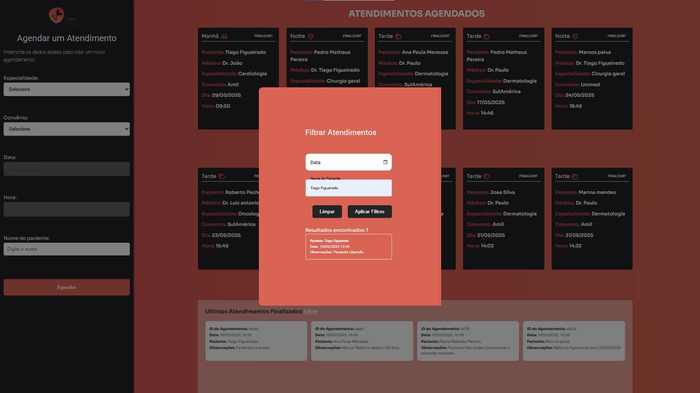

# 🩺 Sistema de Agendamento Médico







Sistema de agendamento médico desenvolvido com **React + TypeScript**, utilizando:

- `React Hook Form` para manipulação de formulários
- `TanStack Query` para gerenciamento de dados assíncronos
- `JSON Server` como API fake

A aplicação permite aos usuários:

- Selecionar especialidades, convênios, médicos e horários disponíveis
- Agendar consultas de forma simples e eficiente
- Visualizar os **últimos atendimentos realizados**
- Filtrar os atendimentos finalizados por **data**

---

## 🧪 Tecnologias Utilizadas

- ⚛️ **React**
- ⛓️ **TypeScript**
- 💅 **CSS Modules**
- 🔄 **React TanStack Query**
- 📝 **React Hook Form**
- 🧩 **Material UI** (em alguns componentes)
- 🗃️ **JSON Server** (API fake para simulação)

---

## 🚀 Instalação e Uso

### 1. Clone o repositório

```bash
git clone https://github.com/FigueiredoTiago/TestePraticoLigaFrontEnd.git
```

### 2. Instale as dependências

```bash
npm install
```

### 3. Inicie a aplicação React

```bash
npm run dev
```

### 4. Inicie o JSON Server (API fake)

```bash
npm run serve
```

---

## 🗂️ Estrutura da Fake API

A API fake expõe as seguintes rotas:

```json
"api/especialidades": "/especialidades",
"api/convenios": "/convenios",
"api/disponibilidades/definir": "/disponibilidades",
"api/disponibilidades": "/disponibilidades",
"api/agendamentos": "/agendamentos",
"api/atendimentos": "/atendimentos"
```

> Edite os dados diretamente no arquivo `db.json` na raiz do projeto.

---

## 🧭 Organização do Projeto

```bash
/api
/src
├── axios/
│   └── Contém todas as funções de fetch utilizadas na aplicação e seus respectivos types.
├── components/
│   ├── Agendamento/              # Renderiza todos os agendamentos e chama o modal de atendimento
│   ├── Finalizados/             # Mostra todos os atendimentos finalizados
│   ├── ModalAtendimento/        # Modal para finalizar um agendamento
│   ├── ModalFiltrarPorData/     # Modal de busca para filtrar atendimentos por data
│   └── SideBarAgendamento/      # Barra lateral para criação de novos agendamentos
├── pages/
│   └── Dashboard/               # Exibe o SideBar e os componentes de agendamento
```

---

## 👨‍💻 Desenvolvedor

**Tiago Figueiredo**
